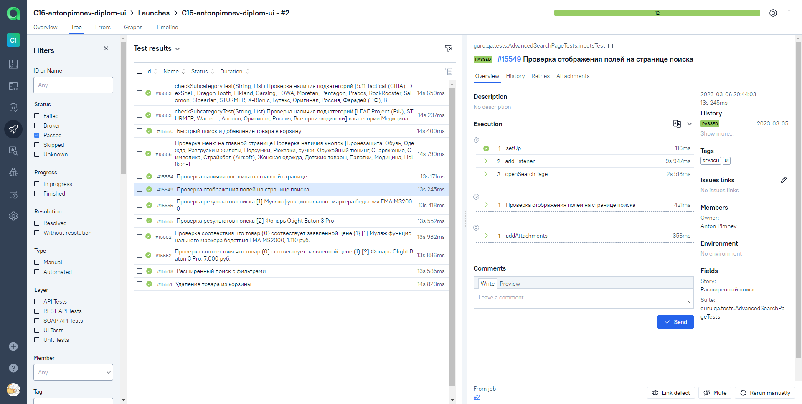

## Учебный проект по автоматизации тестирования (Web UI)

### Веб сайт <a target="_blank" href="https://sturmuniform.ru/">Интернет-магазин sturmuniform.ru</a>

<p align="center">

</p>

## Содержание:

- Технологии и инструменты
- Список проверок, реализованных в тестах
- Запуск тестов (сборка в Jenkins)
- Allure-отчет
- Интеграция с Allure TestOps
- Уведомление в Telegram о результатах запуска тестов
- Видео пример прохождения тестов

## Технологии и инструменты

<p align="center">
<a href="https://www.jetbrains.com/idea/"></a>
<a href="https://www.java.com/"></a>
<a href="https://github.com/"></a>
<a href="https://junit.org/junit5/"></a>
<a href="https://gradle.org/"></a>
<a href="https://selenide.org/"></a>
<a href="https://aerokube.com/selenoid/"></a>
<a href="https://github.com/allure-framework/allure2"></a>
<a href="https://qameta.io/"></a>
<a href="https://www.jenkins.io/"></a>
</p>

## Список проверок, реализованных в автотестах

- [x] Проверка наличия логотипа на главной странице
- [x] Проверка меню на главной странице
- [x] Проверка наличия подкатегорий в категории меню
- [x] Проверка результатов быстрого поиска
- [x] Проверка что товар соответствует заявленной цене
- [x] Проверка отображения полей на странице расширенного поиска
- [x] Проверка результатов расширенный поиска
- [x] Проверка добавление товара в корзину
- [x] Проверка удаления товара из корзины

## Запуск тестов

###  Локальный запуск :
Пример командной строки:
```bash
gradle clean ui
```
Получение отчёта:
```bash
allure serve build/allure-results
```

###  Удаленный запуск (в Jenkins):
1. Открыть <a target="_blank" href="https://jenkins.autotests.cloud/job/C16-antonpimnev-diplom-ui/">проект</a>


2. Выбрать пункт **Собрать с параметрами**
3. В случае необходимости изменить параметры, выбрав значения из выпадающих списков
4. Нажать **Собрать**


5. Результат запуска сборки можно посмотреть в отчёте Allure


## </a> Отчет в <a target="_blank" href="https://jenkins.autotests.cloud/job/C16-antonpimnev-diplom-ui/2/allure/">Allure report</a>

###  Главная

<p align="center">

</p>

###  Тесты

<p align="center">

</p>

###  Графики

<p align="center">

</p>


## </a> Интеграция с <a target="_blank" href="https://allure.autotests.cloud/launch/20028">Allure TestOps</a>
### Общий список тест-кейсов:
<p align="center">

</p>

### Dashboard с общими результатами тестирования
<p align="center">

</p>

### Пример отчёта выполнения одного из запусков
<p align="center">

</p>

## </a> Уведомление в Telegram о результатах выполнения запуска тестов

<p align="center">

</p>

## </a> Видео прохождения тестов
<p align="center">
</a>
</p>

[Вернуться к оглавлению ⬆](#logo)
